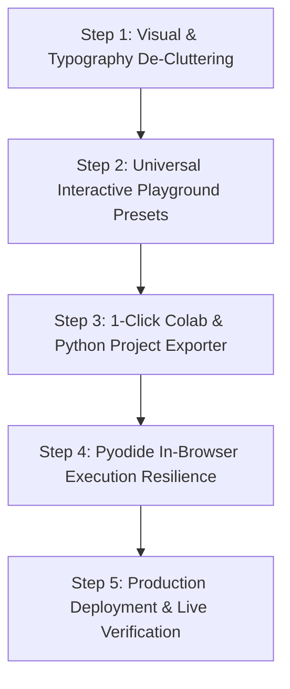

# 🏛️ Socrates AI — Master Execution Plan & Project Roadmap

> **Target:** Complete, production-grade, beginner-friendly AI/ML/DL interactive learning tutor with 0 jargon barriers, real-world scikit-learn ML contracts, real-time code execution, interactive testing playgrounds, and one-click Google Colab / standalone Python export.

---

## 📌 Executive Summary & Current Health Check

| Metric | Status | Details |
| :--- | :---: | :--- |
| **Test Suite** | ✅ **31 / 31 Passing** | Vitest suite covering diagnostics, learner mastery, model priority cascade, evaluation agreement (95%), and concept graphs. |
| **TypeScript / Build** | ✅ **0 Errors** | `npx tsc --noEmit` clean; `npm run build` static generation passes for all 10 app routes. |
| **Domain Grounding** | ✅ **7 Real ML Domains** | Grounded in authentic scikit-learn architectures (Vision, NLP, Recommenders, Audio/Voice, Cybersecurity, Sales Forecasting, Customer Churn). |
| **Typography & Layout** | 🔄 **In Progress** | Phase 1 Theory Masterclass upgraded with dynamic bullet cards and code badges; Phase 2 & 3 being standardized. |

---

## 🎯 The Vision for Socrates

A beginner with basic Python knowledge should be able to sit down with Socrates, choose any project idea, and build a functioning, mathematically sound machine learning model from scratch without ever feeling intimidated or confused by unexplained academic jargon.

---

## 🗺️ Master Step-by-Step Implementation Plan

---

### Step 1: Typography & Layout De-Cluttering Across All Views
**Goal:** Transform dense, wall-of-text elements into breathable, high-contrast, beautiful learning cards.

#### Actions:
1. **Phase 1 Theory View (`src/components/Phase1TheoryView.tsx`)**:
   - ✅ Introduce `FormattedContent` component with auto-detection of bullet points (`•`, `-`, numbered lists).
   - ✅ Introduce `renderFormattedInlineText` highlighting variables (`X_train`, `y_train`, `model.fit()`, etc.) into styled code badges.
   - ✅ Increase body text scale from cramped `text-xs`/`text-sm` to `text-[15px]` / `md:text-base` with generous line-height (`leading-relaxed` / `leading-7`).
2. **Phase 2 Code Sandbox View (`src/components/Phase2BuildView.tsx`)**:
   - Upgrade task descriptions and code comments with generous vertical padding (`space-y-4`).
   - Format test assertion requirements into clear, step-by-step checklist cards with icons.
   - Expand hint dialogs with syntax-highlighted code snippets instead of inline text blobs.
3. **Phase 3 Model Playground View (`src/components/Phase3TestView.tsx`)**:
   - Ensure slider cards, unit indicators, and confidence score displays have adequate spacing and do not wrap on mobile or smaller laptop screens.
4. **Diagnostics & Quiz Views (`src/components/DiagnosticsView.tsx`, `LessonView.tsx`)**:
   - Standardize option buttons with minimum touch height (`min-h-[52px]`), border highlights, and legible `text-sm` / `text-base` fonts.

---

### Step 2: Universal Interactive Playground Presets for All 7 Domains
**Goal:** In Phase 3, learners test their model with realistic sliders, real-time predictions, and one-click scenario presets.

#### Actions:
1. **Domain-Specific Interactive Controls (`src/lib/inference.ts`)**:
   - **Computer Vision (Object Detection):** Sliders for Box Width, Box Height, Center X, Center Y, IoU Threshold.
   - **Cybersecurity (Intrusion Detection):** Sliders for Packet Size (bytes), Connection Duration (sec), Failed Login Attempts, Port Number, Protocol selector.
   - **Sales Demand Forecasting:** Sliders for Previous Week Sales, Discount %, Holiday (Yes/No), Day of Week, Store Traffic.
   - **Audio / Speech Emotion:** Sliders for Fundamental Pitch (Hz), Zero-Crossing Rate, Spectral Centroid, Energy Amplitude.
   - **Customer Churn:** Sliders for Tenure (Months), Monthly Charge ($), Total Charges, Contract Length, Support Tickets.
   - **NLP / Spam & Fake News:** Text input box with real-time token frequency analysis and spam keyword probability bar.
   - **Recommender Systems:** User rating sliders across 4 top movie/item genres.
2. **One-Click Presets ("Try A Real-World Scenario")**:
   - Add 3 realistic quick-fill presets for every domain (e.g. *“Cyber Attack: Brute Force Attempt”* vs *“Benign HTTPS Browsing”*) so beginners can observe model behavior immediately without guessing numbers.

---

### Step 3: Complete Project Exporter (1-Click Google Colab & Standalone Python)
**Goal:** Empower the student to download their working model and run it on their own machine or Google Colab with 0 configuration.

#### Actions:
1. **Export Artifacts Generator (`src/lib/exportProject.ts`)**:
   - `model.py` / `train.py`: Clean, standalone, PEP8-compliant Python script containing:
     - Synthetic / benchmark dataset generation.
     - Feature scaling / preprocessing pipeline.
     - Model training loop (`scikit-learn`).
     - Evaluation metrics (Accuracy, F1, Confusion Matrix / MAE, R²).
     - Interactive prediction helper function.
   - `requirements.txt`: Minimal pinned requirements (`scikit-learn>=1.3.0`, `numpy>=1.24.0`, `pandas>=2.0.0`).
   - `notebook.ipynb`: Valid Jupyter Notebook format with markdown explanation cells for each step.
2. **Export UI in `AssembledProjectView.tsx`**:
   - Prominent **“Download Full Code (.zip)”** button using in-browser JSZip.
   - **“Open in Google Colab”** button that creates a GitHub Gist or opens directly in Colab.
   - Interactive terminal output preview showing what happens when running `python train.py`.

---

### Step 4: In-Browser Pyodide Execution Resilience & Error Translation
**Goal:** Ensure code execution in Phase 2 works seamlessly regardless of client hardware or network speed.

#### Actions:
1. **Smart Pyodide Preloading & Fallback**:
   - Initialize Pyodide WebAssembly in a Web Worker to keep the UI smooth and responsive.
   - If WebAssembly download is slow or offline, provide a rule-based AST validation fallback that checks the user's code structure and syntax without crashing.
2. **Beginner-Friendly Error Translator**:
   - Intercept raw Python tracebacks and present a plain English explanation:
     - `IndexError: list index out of range` ➡️ *"💡 Tip: Python lists start counting at 0. If your list has 3 items, the last item is at index 2, not 3."*
     - `KeyError` ➡️ *"💡 Tip: You looked for a column name that doesn't exist in the dictionary/DataFrame. Check spelling!"*
     - `TypeError: unsupported operand type(s)` ➡️ *"💡 Tip: You tried to add or multiply text (string) with a number."*

---

### Step 5: Production Deployment & Verification
**Goal:** Ship Socrates to production with full live verification.

#### Actions:
1. **Environment Setup**:
   - Configure `GEMINI_API_KEY` on Vercel project environment variables.
   - Verify fallback modes for zero-API-key local testing.
2. **Production Build & Verification**:
   - Run `npm run build` to confirm zero static optimization errors.
   - Run `npm test` to ensure all 31 tests pass.
3. **Deployment**:
   - Push to `main` branch on GitHub (`https://github.com/Suhas1010/Socrates.git`).
   - Deploy to Vercel production.
4. **End-to-End Live User Journey Verification**:
   - Goal selection ➡️ Diagnostics ➡️ Phase 1 Theory ➡️ Phase 2 Code ➡️ Phase 3 Testing ➡️ Export.

---

## 📋 Execution Order & Next Immediate Actions

| Step | Action | Files Modified | Output |
| :---: | :--- | :--- | :--- |
| **1** | Fix layout clutter & typography | `src/components/Phase1TheoryView.tsx`, `Phase2BuildView.tsx`, `Phase3TestView.tsx` | Clean, breathable, high-contrast UI |
| **2** | Wire interactive presets & sliders | `src/lib/inference.ts`, `src/components/Phase3TestView.tsx` | Realistic live sliders for all 7 domains |
| **3** | Build project export bundle | `src/lib/exportProject.ts`, `src/components/AssembledProjectView.tsx` | 1-Click ZIP & Colab export |
| **4** | Error translator & Pyodide fallback | `src/lib/pyodide.ts`, `src/lib/errorTranslator.ts` | Zero-frustration student debugging |
| **5** | Deploy & Live Walkthrough | GitHub / Vercel | Live public URL |
